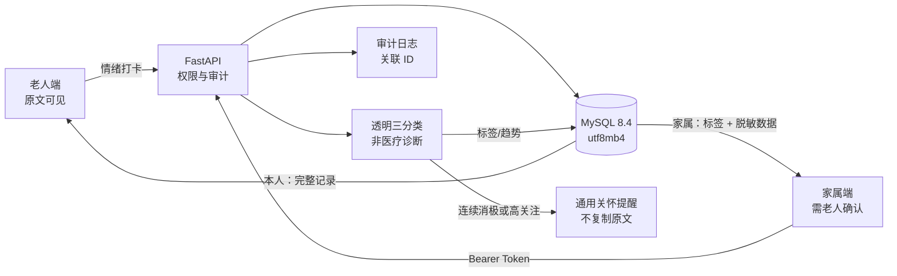
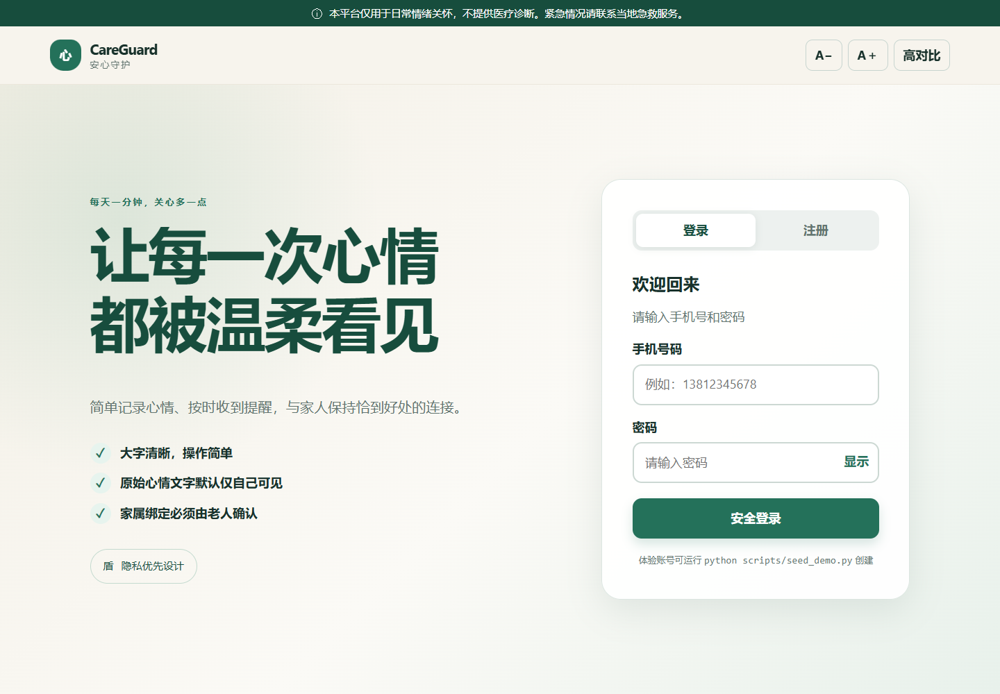
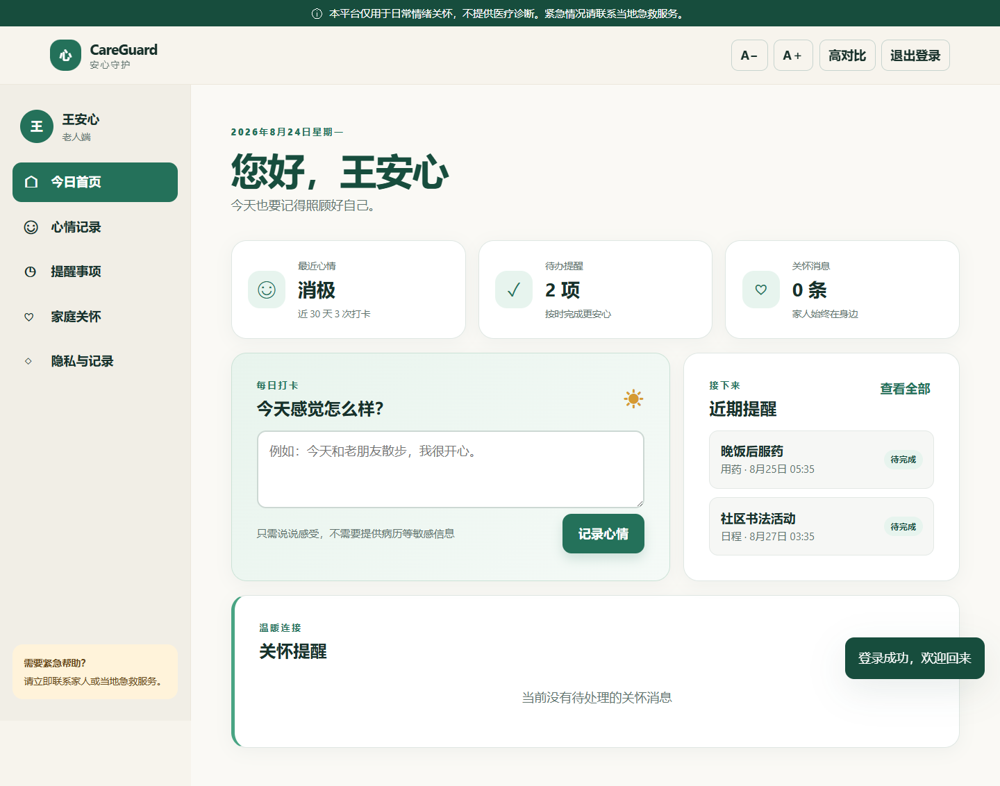
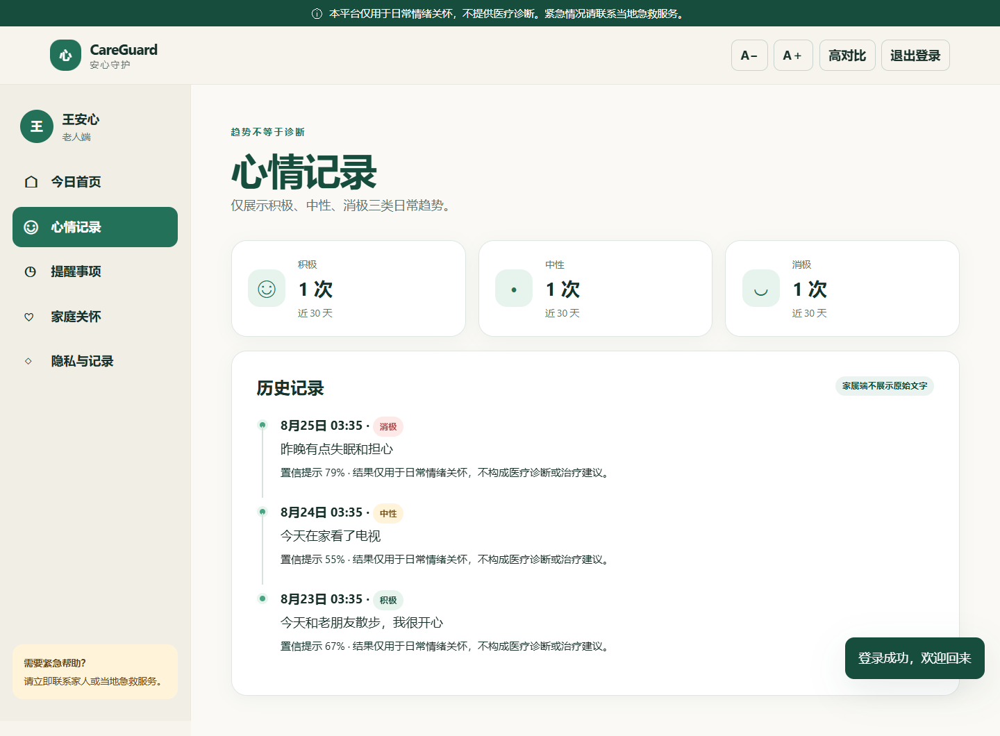
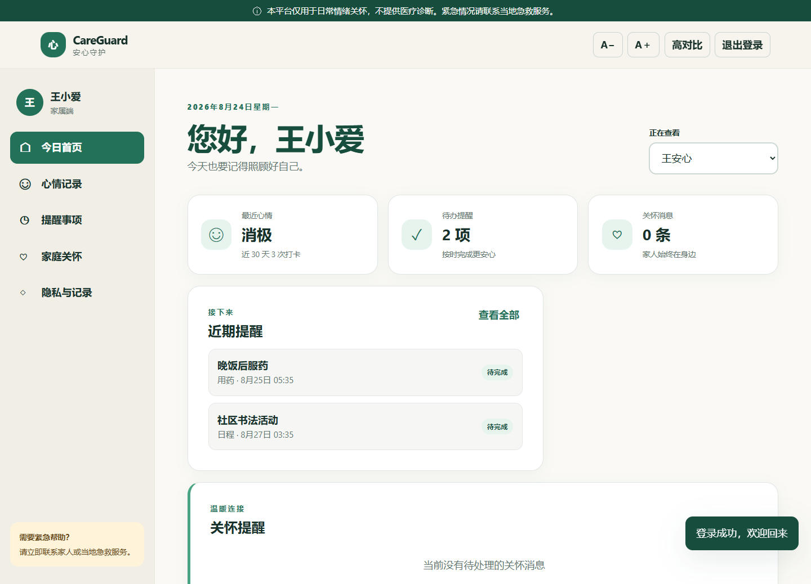

# CareGuard QA —— 适老化情绪关怀平台质量保障项目

**项目身份：个人测试工程项目（Personal QA Engineering Portfolio Project）。** 本项目独立于任何“三千计划”或既有团队成果，所有需求、代码、测试资产和报告均在此仓库内单独维护。项目的重点不是套壳聊天机器人，而是一套可运行、可验证、可追溯的质量保障工程。

[English README](README_EN.md) · [需求规格](docs/requirements.md) · [测试计划](docs/test-plan.md) · [50 条测试用例](docs/test-cases.md) · [缺陷演练索引](docs/defects/README.md) · [Swagger](http://127.0.0.1:8000/docs)

> 招聘方快速入口：先看下方“当前实际核验基线”和运行截图，再阅读 [3 分钟项目导览](docs/portfolio-walkthrough.md)。所有展示数据均来自仓库内证据，未把目标值写成实测结果。

## 项目亮点

- FastAPI + SQLAlchemy + MySQL 8.4 实现老人端/家属端、双向同意绑定、情绪打卡、提醒、联系人、关怀告警、数据导出和审计。
- 情绪功能只做透明的积极/中性/消极三分类；模型卡明确排除医疗诊断、治疗建议和自动急救派单。
- 访问控制按“角色 + 具体绑定对象 + active 状态”校验；家属看到标签和统计，但原始情绪文字强制为 `null`。
- 手机号、联系人姓名在业务响应中脱敏；密码 bcrypt 哈希；JWT 有时效；关键操作有审计；统一返回请求关联 ID 和安全响应头。
- 适老化 Web UI 支持默认 18px 字号、放大/缩小、高对比、键盘焦点、42px 以上触控目标、移动布局和不依赖颜色的状态反馈。
- 完整 QA 资产：pytest、requests/TestClient、Playwright、Postman、SQL 一致性检查、JMeter、MySQL 合约测试和 GitHub Actions 三路流水线。
- 增强的 AI QA：30 条版本化中文评估集、逐类 Precision/Recall/F1、Macro-F1、高关注召回和失败样本输出。

## 业务与隐私架构



家庭邀请在 `pending` 阶段没有任何数据共享权；只有老人本人确认后成为 `active`。任一成员解除关系后，共享接口立即拒绝访问。

## 快速运行

### 方式 A：MySQL + Docker（正式演示路径）

```bash
docker compose up --build -d
docker compose exec api python scripts/seed_demo.py
```

也可以在宿主机建立虚拟环境、连接容器中的 MySQL 后运行或调试：

```powershell
Copy-Item .env.example .env
python -m venv .venv
.\.venv\Scripts\Activate.ps1
python -m pip install -e ".[test]"
python scripts/seed_demo.py
uvicorn app.main:app --reload
```

`.env.example` 默认连接 Docker 暴露的 MySQL。访问：

- Web UI：<http://127.0.0.1:8000>
- Swagger：<http://127.0.0.1:8000/docs>
- ReDoc：<http://127.0.0.1:8000/redoc>
- 健康检查：<http://127.0.0.1:8000/health/ready>

演示账号（只用于本地虚构数据）：

| 身份 | 手机号 | 密码 |
|---|---|---|
| 老人 | `13800000001` | `Care1234` |
| 家属 | `13800000002` | `Care1234` |

### 方式 B：Windows 免安装 MySQL 8.4（无需 Docker）

项目提供可复现的官方免安装版脚本，不覆盖系统中已有的 MySQL，也不注册 Windows 服务。它会下载 MySQL Community Server 8.4.11 LTS，校验 MD5 与 SHA-256，在 `127.0.0.1:3307` 初始化隔离实例，并创建专用的 `careguard_test` 测试库。

```powershell
.\scripts\setup_mysql84_portable.ps1
.\scripts\start_mysql84_portable.ps1
```

返回的 `DATABASE_URL` 可直接用于本项目。完成后可安全停止隔离实例：

```powershell
.\scripts\stop_mysql84_portable.ps1
```

下载包和数据目录只保存在被 Git 忽略的 `work/mysql-runtime/`；源码包不会塞入 268MB 的第三方二进制文件。

### 方式 C：SQLite 零配置快速预览

不创建 `.env` 时默认使用 `careguard.db`，便于面试现场快速展示；项目的正式数据库合约、Docker 和数据检查仍以 MySQL 8.4 为准。

```powershell
python -m pip install -e ".[test]"
python scripts/seed_demo.py
uvicorn app.main:app --reload
```

## 自动化测试

### pytest API / 域规则 / 数据结构

```powershell
.\scripts\run_api_tests.ps1
```

该命令排除需外部服务的 UI/MySQL 标记，执行独立内存数据库测试并生成终端与 HTML 覆盖率报告。覆盖范围包括：认证、密码与同意校验、对象级越权、绑定状态机、三分类与否定词、原文隔离、告警去重、联系人脱敏、审计、导出和安全头。

### Playwright UI

先安装 Chromium 并启动应用：

```powershell
python -m playwright install chromium
uvicorn app.main:app
# 另开终端
.\scripts\run_ui_tests.ps1
```

7 条 UI 场景覆盖医疗边界提示、字号、高对比、老人注册、情绪打卡/历史、家属绑定引导和退出会话。

### Postman / Newman

导入：

- `postman/CareGuard-QA.postman_collection.json`
- `postman/local.postman_environment.json`

从空库按顺序运行集合。集合动态生成双角色手机号并自动传递 Token、用户 ID、绑定 ID、提醒 ID 和告警 ID；断言验证状态、响应时间、关联 ID、三分类、原文隔离、联系人脱敏和模型边界。

```bash
newman run postman/CareGuard-QA.postman_collection.json \
  -e postman/local.postman_environment.json \
  --reporters cli,junit \
  --reporter-junit-export outputs/newman-report.xml
```

### MySQL 数据一致性

```bash
mysql -h 127.0.0.1 -ucareguard -pcareguard_dev careguard < sql/consistency_checks.sql
```

`DQ-001` 至 `DQ-024` 检查重复手机号、关系角色/状态、孤儿数据、枚举、置信范围、提醒授权、联系人格式、告警来源和审计完整性；验收要求全部 `issue_count=0`。

### JMeter 性能基准

```bash
jmeter -n -t jmeter/CareGuard-Smoke-Load.jmx \
  -Jusers=20 -Jramp=20 -Jloops=5 \
  -l outputs/jmeter-results.jtl \
  -e -o outputs/jmeter-html
```

默认每个用户只注册一次，然后循环“情绪写入 → 统计读取 → 提醒写入”，内置状态码、返回字段和 1s/1.5s 响应时间断言。容量数字必须引用在目标硬件上实际生成的报告。

### AI 基准评估

```powershell
python scripts/evaluate_emotion.py
```

报告写入 `outputs/ai-evaluation.json`。评估集是 QA 基线，不是临床验证集；置信提示是规则证据强度，不是校准概率。

## GitHub Actions

`.github/workflows/quality.yml` 包含三个互相独立的门禁：

1. API/域规则/SQLite 隔离测试与 75% 覆盖率门槛；
2. MySQL 8.4 临时服务、PyMySQL 连接、utf8mb4 和表结构合约；
3. 启动真实 Web 服务、安装 Chromium、执行 7 条 Playwright 流程。

失败时仍上传覆盖率证据；所有作业使用虚构动态测试数据。

## 当前实际核验基线（2026-08-24）

以下结果来自当前 Windows/Python 3.13 本机。常规 pytest 使用 SQLite 做快速隔离；数据库合约、端到端 API、真实浏览器流程、数据一致性和第二轮性能基准均已连接本机隔离的 MySQL 8.4.11 实例实测。

| 检查 | 实际结果 |
|---|---|
| pytest API/域/结构 | 48 passed；应用覆盖率 90.67% |
| MySQL 8.4 合约 | 5 passed；版本/连接、InnoDB、utf8mb4、唯一约束/外键、中文 Emoji 回写与回滚、孤儿数据拒绝 |
| Playwright/Chrome + MySQL | 7 passed；包含字号、高对比、双角色和情绪主流程 |
| Postman/Newman + MySQL | 28 requests；114 assertions；0 failed；平均响应 54ms |
| MySQL SQL 数据检查 | DQ-001—DQ-024 全部 `issue_count=0`（在接口、UI、压测数据写入后复查） |
| AI 基准 | 30/30；Macro-F1 1.0；高关注召回 1.0（小型策划集，非临床验证） |
| JMeter + MySQL 8.4 | 20 用户 × 5 轮；340 样本；0% 错误；12.51 samples/s；总 P90 55.9ms |
| MySQL 业务 P90 | 情绪写入 53ms；统计读取 15ms；提醒写入 53ms；注册 551.3ms |

MySQL 官方包实测版本为 8.4.11，MD5 `2e833921898a9a030ea6bfe81bd811bc`，SHA-256 `a492371d687d2bab088b0062581144a0044b8964baefdf4faa579292b423d25c`。实际证据位于 `outputs/`。这些是本机质量基线，不是生产容量声明。首次 UI 和 Newman 失败曾发现真实前端异步缺陷及集合脚本兼容问题，修复后的最终 JUnit/Newman 报告为全绿；BUG-011 记录了前端问题。

### 运行截图

| 登录与适老化入口 | 老人首页 |
|---|---|
|  |  |
| 情绪历史 | 家属首页 |
|  |  |

## 仓库结构

```text
app/                    FastAPI、SQLAlchemy、权限/情绪服务、适老化 Web UI
tests/                  API/域/SQL/MySQL/Playwright 自动化
postman/                可顺序执行的端到端接口集合与环境
sql/                    MySQL 初始化与 24 项一致性检查
jmeter/                 可参数化写读混合性能场景
docs/                   SRS、测试计划、50 条用例、11 份缺陷报告
scripts/                演示数据、测试入口、AI 评估
.github/workflows/      API、MySQL、UI 三路 CI
outputs/                 实际运行后生成的报告和截图
```

## 已知限制与下一步

- 规则分类器可解释但无法可靠理解反讽、方言和长篇混合情绪；扩展模型前必须建立更大盲测集和分群误差分析。
- 当前演示 UI 使用 localStorage 保存令牌；公开部署前应改成 `Secure + HttpOnly + SameSite` Cookie，并加入 CSRF 方案、密钥托管和登录限流。
- 自动创建表适合演示；生产应使用 Alembic 迁移、最小权限数据库账号、备份恢复和保留/删除策略。
- 尚未接入真实短信、推送或急救服务，避免个人项目误触真实人员。

## 岗位能力映射

| QA 能力 | 本仓库证据 |
|---|---|
| 测试设计与缺陷复现 | 50 条分层用例；10 份缺陷注入记录 + 1 份真实预发布缺陷 |
| Python / pytest | API、域规则、数据库结构、权限和隐私负向测试 |
| Postman | 跨角色端到端集合、动态变量、断言和关联 |
| SQL / MySQL | utf8mb4 合约、24 项一致性检查、Docker MySQL |
| Playwright | 真实浏览器主流程与适老化交互 |
| 性能 | 可参数化 JMeter 写读混合负载和 SLA 断言 |
| Git / CI | GitHub Actions 三路质量门禁与报告制品 |
| AI QA | 模型卡、版本化评估集、Macro-F1、高关注召回、隐私边界 |
| 英语沟通 | 完整英文 README 与英文代码/CI/报告字段 |

参考岗位链接：[Bosch 软件测试工程师](https://jobs.smartrecruiters.com/BoschGroup/744000120860367--bcsc) · [Bosch AI Software QA Internship](https://jobs.smartrecruiters.com/BoschGroup/744000128919569--bd-ai-software-qa-intern-next-gen-ai-driven-testing-6-month-internship-)

## 真实性声明

README 中“用例/脚本数量”描述设计资产；“通过率、覆盖率、性能、缺陷关闭数”只能以 `outputs/` 内的实际运行报告为准。在测试真正执行前，不应把目标数字写成简历成果。
