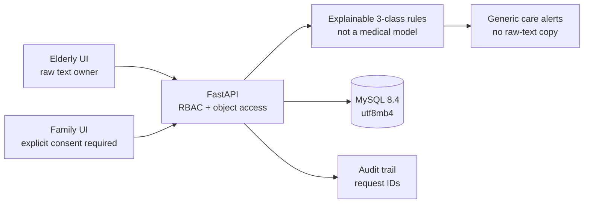

# CareGuard QA — Quality Engineering for an Age-Friendly Emotional Care Platform

**Project identity: an independent personal QA engineering portfolio project.** It is not part of any previous team program or “Three-Thousand Plan.” Requirements, implementation, tests, and evidence are maintained in this repository.

CareGuard is deliberately not a chatbot wrapper. It is a runnable FastAPI/MySQL product used to demonstrate risk-based testing, API and UI automation, SQL validation, performance testing, privacy engineering, and responsible evaluation of a limited AI-like feature.

## What is implemented

- Elderly and family registration/login with expiring JWTs and bcrypt password hashes.
- Consent-based care links: a family member can invite, but the elderly account must explicitly accept before any data is shared.
- Daily mood check-ins and history with only three labels: positive, neutral, and negative.
- A transparent Chinese lexicon/negation baseline, a public model card, a versioned 30-case evaluation set, and per-class metrics.
- Medication and schedule reminders, recurrence, completion, and linked-family management.
- Masked emergency contacts and generic wellbeing alerts for a negative streak or high-attention phrases.
- Data minimization: linked family members receive mood labels and statistics, never the raw check-in text.
- Self-service JSON export, per-actor audit trail, correlation IDs, CSP, frame denial, and MIME-sniffing protection.
- An age-friendly responsive UI with a large default font, font controls, high contrast, keyboard focus, large targets, plain-language feedback, and a visible non-medical boundary.

## Architecture



Object authorization requires the exact elderly ID, family ID, and an `active` link. A pending or revoked record grants no access.

## Run locally

### MySQL/Docker path

```bash
docker compose up --build -d
```

Create `.env` from `.env.example`, install the local package, seed fictitious demo data, and start the service:

```powershell
Copy-Item .env.example .env
python -m venv .venv
.\.venv\Scripts\Activate.ps1
python -m pip install -e ".[test]"
python scripts/seed_demo.py
uvicorn app.main:app --reload
```

Open the [web UI](http://127.0.0.1:8000), [Swagger](http://127.0.0.1:8000/docs), or [readiness endpoint](http://127.0.0.1:8000/health/ready).

Fictitious local accounts created by the seed script:

| Role | Phone | Password |
|---|---|---|
| Elderly | `13800000001` | `Care1234` |
| Family | `13800000002` | `Care1234` |

### Portable MySQL 8.4 on Windows (no Docker required)

The repository includes reproducible scripts that download the official MySQL Community Server 8.4.11 LTS archive, verify both MD5 and SHA-256, initialize an isolated instance on `127.0.0.1:3307`, and create the dedicated `careguard_test` database. They do not replace an existing MySQL installation or register a Windows service.

```powershell
.\scripts\setup_mysql84_portable.ps1
.\scripts\start_mysql84_portable.ps1
```

Stop the isolated instance after testing:

```powershell
.\scripts\stop_mysql84_portable.ps1
```

The downloaded binaries and data remain under the Git-ignored `work/mysql-runtime/`. Without `.env`, the normal application commands still use SQLite for a zero-setup demo.

## Quality assets

| Layer | Tool and evidence |
|---|---|
| Unit/API | pytest + TestClient, isolated in-memory database, coverage gate ≥75% |
| Browser | Seven self-contained Playwright Chromium flows |
| API demonstration | Ordered Postman collection with generated users, chained IDs/tokens, and privacy assertions |
| Database | MySQL driver/utf8mb4 contract plus 24 runnable consistency queries |
| Performance | Parameterized JMeter registration → mood → statistics → reminder journey |
| AI evaluation | 30 balanced Chinese cases, Accuracy, Macro-F1, per-class metrics, high-attention recall |
| Test design | One SRS, one risk-based test plan, 50 functional cases, ten injected-defect reports plus one real pre-release defect |
| CI | Independent API, MySQL, and real-browser GitHub Actions jobs |

Run the fast suite:

```powershell
.\scripts\run_api_tests.ps1
```

Run UI tests after starting the app:

```powershell
python -m playwright install chromium
$env:RUN_UI_TESTS = "1"
python -m pytest tests/ui -m ui -v
```

Run the AI baseline evaluation:

```powershell
python scripts/evaluate_emotion.py
```

Postman assets are in `postman/`; the JMeter plan and exact command are in `jmeter/README.md`; MySQL checks are in `sql/consistency_checks.sql`.

## Verified local baseline (2026-08-24)

| Check | Actual result |
|---|---|
| pytest API/domain/schema | 48 passed; 90.67% application coverage |
| MySQL 8.4 contract | 5 passed: version/connection, InnoDB/utf8mb4, constraints, Chinese/emoji round trip and rollback, orphan-FK rejection |
| Playwright with installed Chrome + MySQL | 7 passed |
| Postman/Newman + MySQL | 28 requests; 114 assertions; 0 failures; 54 ms average response |
| MySQL consistency SQL | DQ-001 through DQ-024 all returned `issue_count=0` after API, UI, and load-test writes |
| Curated AI baseline | 30/30; Macro-F1 1.0; high-attention recall 1.0; not clinical validation |
| JMeter + MySQL 8.4 | 20 users × 5 loops; 340 samples; 0% errors; 12.51 samples/s; total P90 55.9 ms |
| MySQL endpoint P90 | mood 53 ms; statistics 15 ms; reminder 53 ms; registration 551.3 ms |

The verified official archive is MySQL 8.4.11 with MD5 `2e833921898a9a030ea6bfe81bd811bc` and SHA-256 `a492371d687d2bab088b0062581144a0044b8964baefdf4faa579292b423d25c`. These results are local evidence, not production capacity claims. Final reports and screenshots are under `outputs/`.

## Safety and limitations

Mood output is for everyday care only. It does not diagnose a condition, recommend treatment, infer medication dosage, dispatch emergency services, or replace qualified help. The rule baseline will miss sarcasm, dialects, and complex mixed-emotion narratives. Confidence is evidence strength, not calibrated probability.

The demo stores its bearer token in localStorage. Before public deployment, move the session to Secure/HttpOnly/SameSite cookies, add CSRF protection and authentication rate limiting, use managed secrets, replace automatic table creation with migrations, and implement formal retention/deletion workflows.

## Evidence integrity

Counts of designed cases and scripts describe repository assets. Pass rates, coverage, latency, and closed-defect claims are valid only when supported by actual reports under `outputs/`. Target numbers must not be presented as completed résumé achievements before execution.

See the [Chinese requirements](docs/requirements.md), [test plan](docs/test-plan.md), [50 test cases](docs/test-cases.md), and [defect exercise index](docs/defects/README.md).
